# Compost Connecté

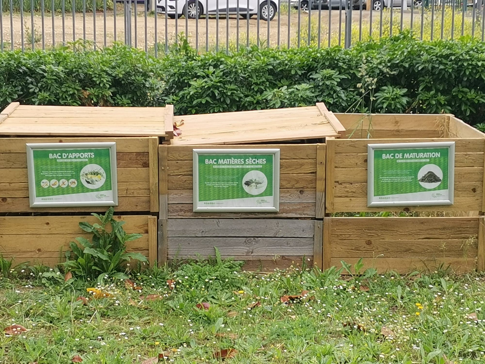

## Sommaire
- [Introduction](#introduction)
- [Résulat et problèmes rencontrés](#résulat-et-problèmes-rencontrés)
- [Conclusion](#conclusion)
- [À propos des dossiers](#à-propos-des-dossiers)

## Introduction

L’objectif de notre projet était de rendre le compost de l'ENSEA connecté et autonome, qu'il puisse envoyer un message d'alerte si les différents paramètre ne sont pas conforme.   
Nous arrivons donc au cahier des charges suivant :    
        
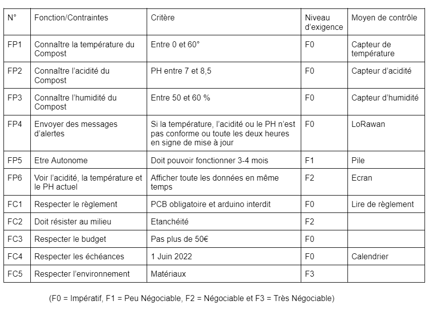     

FP1 : La référence du capteur de température est [SA56004AD](https://www.nxp.com/part/SA56004AD#/), il est à l’ENSEA. Il lui faut une tension entre 3,3 et 5 V et un courant de 100 microA. [Datasheet](https://www.nxp.com/docs/en/brochure/75015962.pdf)    
FP2 : La référence du capteur d’acidité est [32638](https://www.gotronic.fr/art-sonde-ph-interface-sen0161-21552.htm), il n’est pas à l’ENSEA, il coûte 32,30€. Il lui faut une tension de 5V. [Datasheet](https://wiki.dfrobot.com/PH_meter_SKU__SEN0161_)    
FP3 : La référence du capteur d’humidité est [893-7082](https://fr.rs-online.com/web/p/capteurs-de-temperature-et-d-humidite/8937082), il n’est pas à l’ENSEA, il coûte 11,26€. Il lui faut une tension de 5V et un courant de 1,5 mA. [Datasheet](https://www.te.com/commerce/DocumentDelivery/DDEController?Action=showdoc&DocId=Data+Sheet%7FHPC052_J%7FA%7Fpdf%7FEnglish%7FENG_DS_HPC052_J_A.pdf%7FCAT-HSC0006)  
FP6 : La référence de l’écran est [4440](https://www.adafruit.com/product/4440), il est à l’ENSEA. Il lui faut une tension entre 3,3 et 5 V et un courant de 90 mA. [Datasheet](https://cdn-learn.adafruit.com/downloads/pdf/monochrome-oled-breakouts.pdf)   
    
Puisque nous avons deux capteurs et l'écran en connection I2C et le LoRa en connection UART, nous utiliserons un microprocesseur [STM32L412KBT6](https://www.digikey.fr/fr/products/detail/stmicroelectronics/STM32L412KBT6/9656219). Il est a l'ENSEA; [Datasheet](https://www.st.com/resource/en/datasheet/stm32l412kb.pdf)   
    
Le projet avancera d'après le planning prévisionnel suivant :
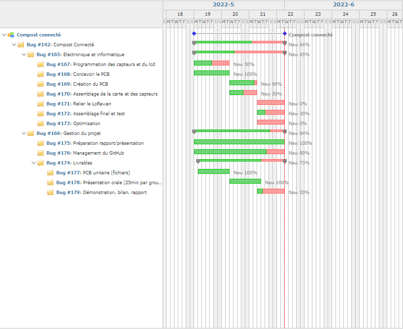   

Les interactions entre les différents composants ainsi que la structure de base du projet est illustré de la manière suivante :
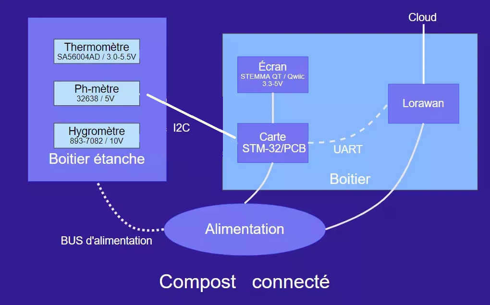

## Résultat et problèmes rencontrés

Globalement, pour tout les PCB, le fichier contraintes a été respecté sauf pour celui du capteur de température. Donc notre PCB est inutilisable.               
Sur le PCB du compost, on a fait des erreurs sur les pin utilisés par le microprocesseur. Ducoup, on ne peut pas connecté le module LoRa et les capteur en I2C en même temps.
                
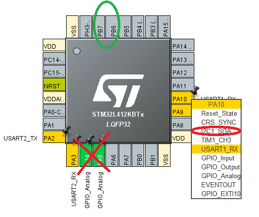   
                
Comme on peut le voir, le pA10 et pA9 permettent soit de faire la connection en UART ou en I2C tandis que pA4 et pA5 ne permet ne permet pas la connection en I2C comme prévu et il aurait fallu donc utilisé les pin pB6 et pB7.
                
Malgrès ça, le PCB du compost et du capteur d'humidité ont leurs composants soudé parfaitement, sans erreur et les valeurs entre chaque point sont juste.               
                
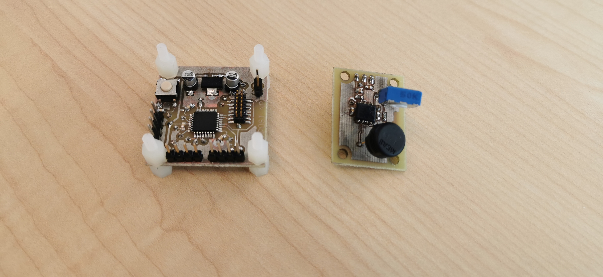   

De plus, le PCB du compost, qui contient le microprosseur a pu être flashé et donc il est prêt à être coder et à l'utilisation.         
        
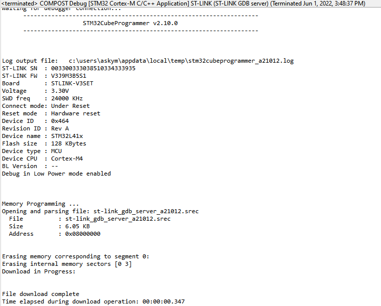        
                
## Conclusion   
        
Pour conclure, il nous restez plus qu'à faire le code des différents composants et de réunir l’ensemble des parties pour faire un test global. Il faudrait aussi corriger les choix des pin sur le schéma du PCB du compost afin d'avoir la connection en I2C et UART. Ce projet nous a permis d'avoir une meilleur prise en main sur des logiciels du type EAGLE ou STM32CubeIDE. Nous avons également appris à s'attribuer des tâches de manière efficace, à communiquer et de se fixer des objectifs tout le long du projet.

## À propos des dossiers
**EAGLE/**    
                
  &emsp; &emsp;  **DRU/**    
  &emsp; &emsp;  Ce dossier contient le fichier contraintes utiliser pour les différents PCB du projet    
  &emsp; &emsp; `ENSEA_2022_04_08.dru`: Le fichier contrainte de l'ensea                
                
  &emsp; &emsp;  **Libraries/**    
  &emsp; &emsp;  Ce dossier contient tout les libraries des composants utiliser dans ce projet    
  &emsp; &emsp; `c1.lbr`: La librarie d'un condensateur de 470 uF utilisé dans le PCB de l'alimentation     
  &emsp; &emsp; `c2.lbr`: La librarie d'un condensateur de 100 uF utilisé dans le PCB de l'alimentation     
  &emsp; &emsp; `c3.lbr`: La librarie d'un condensateur de 470 pF utilisé dans le PCB de l'alimentation      
  &emsp; &emsp; `CapteurHumidite.lbr`: La librarie du capteur d'humidité     
  &emsp; &emsp; `CapteurTemperature.lbr`: La librarie du capteur de température     
  &emsp; &emsp; `cin.lbr`: La librarie d'un condensateur de 10 uF utilisé dans le PCB de l'alimentation ainsi que dans le PCB complet du compost      
  &emsp; &emsp; `cout.lbr`: La librarie d'un condensateur de 22 uF utilisé dans le PCB de l'alimentation ainsi que dans le PCB complet du compost      
  &emsp; &emsp; `l.lbr`: La librarie d'une bobine de 220 uH utilisé dans le PCB de l'alimentation     
  &emsp; &emsp; `MC34063A.lbr`: La librarie du régulateur à découpage utilisé dans le PCB de l'alimentation    
  &emsp; &emsp; `RegLineaire.lbr`: La librarie du régulateur linéaire utilisé dans le PCB de l'alimentation ainsi que dans le PCB complet du compost     
  &emsp; &emsp; `STM32_librairy.lbr`: La librarie du microproccesseur le PCB complet du compost          
                
  &emsp; &emsp;  **PCB/**   
  &emsp; &emsp;  Ce fichier contient tout les schémas et les boards des composants utiliser dans ce projet   
                
  &emsp; &emsp; `Alimentation.sch`: Le schéma du PCB de l'alimentation        
        
  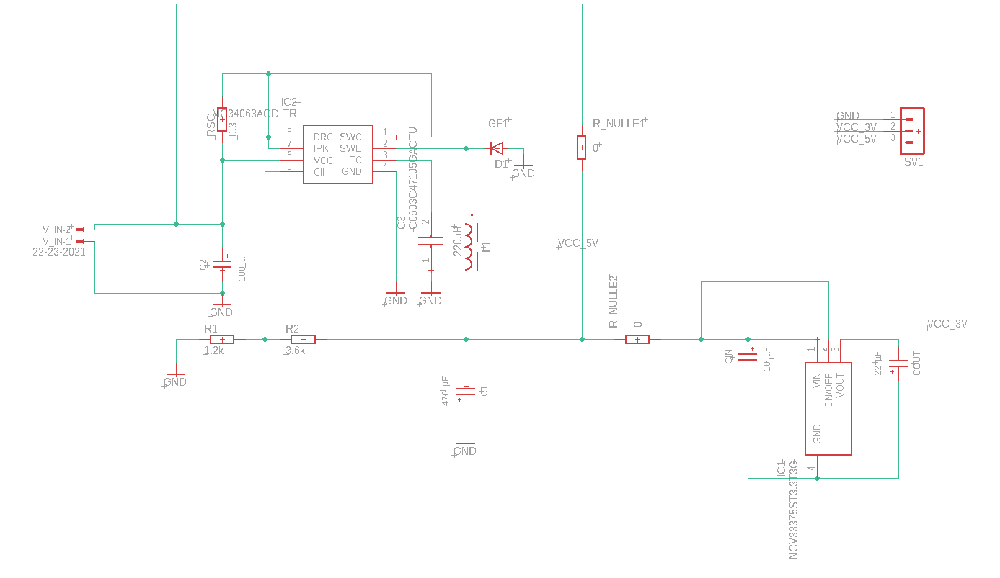        
        
  &emsp; &emsp; `Alimentation.brd`: Le board du PCB de l'alimentation    
        
  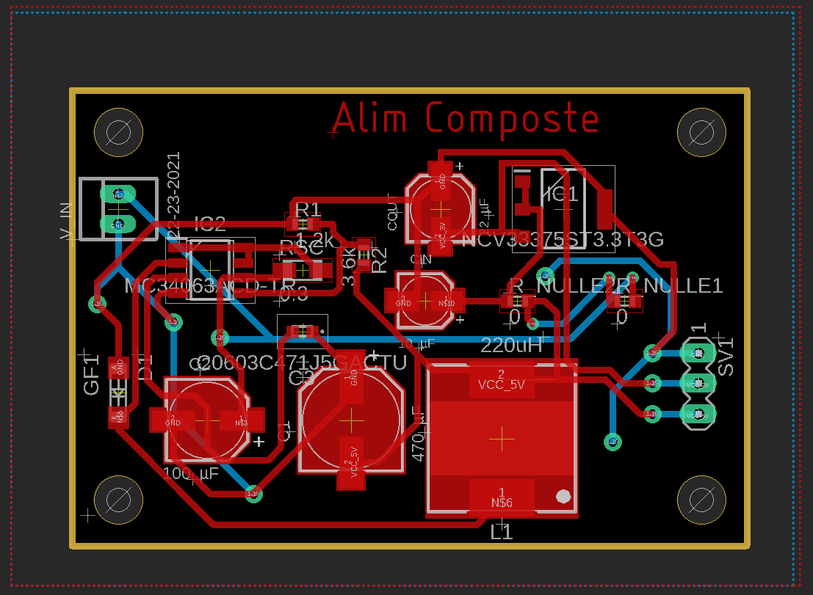    
        
  &emsp; &emsp; `CapteurHumidite.sch`: Le schéma du PCB du capteur d'humidité  
  
  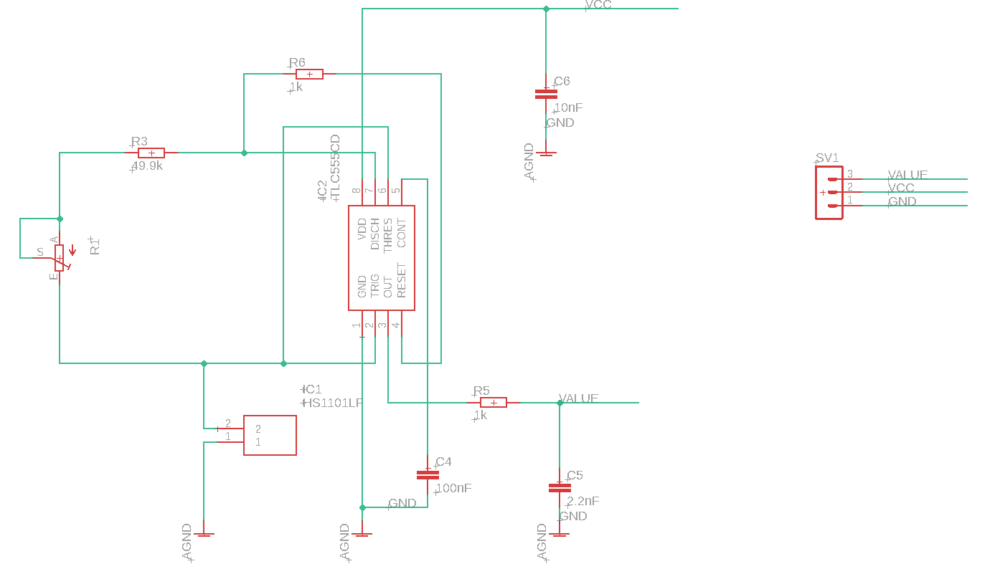     
            
  &emsp; &emsp; `CapteurHumidite.brd`: Le board du PCB du capteur d'humidité    
        
  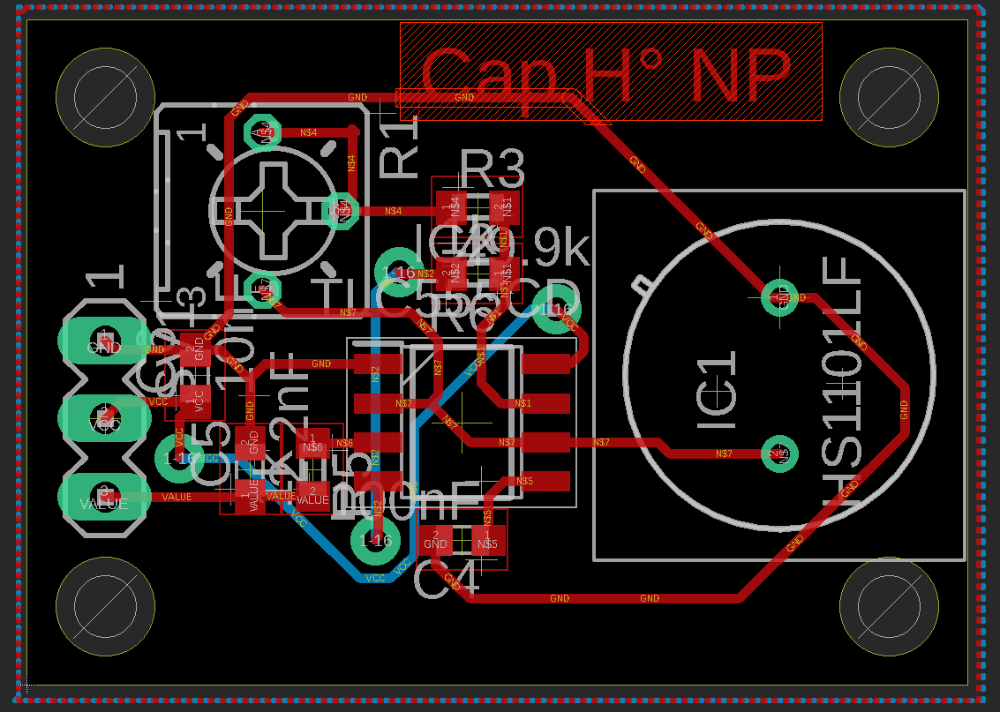     
        
  &emsp; &emsp; `CapteurTemperature.sch`: Le schéma du PCB du capteur dde température  
        
  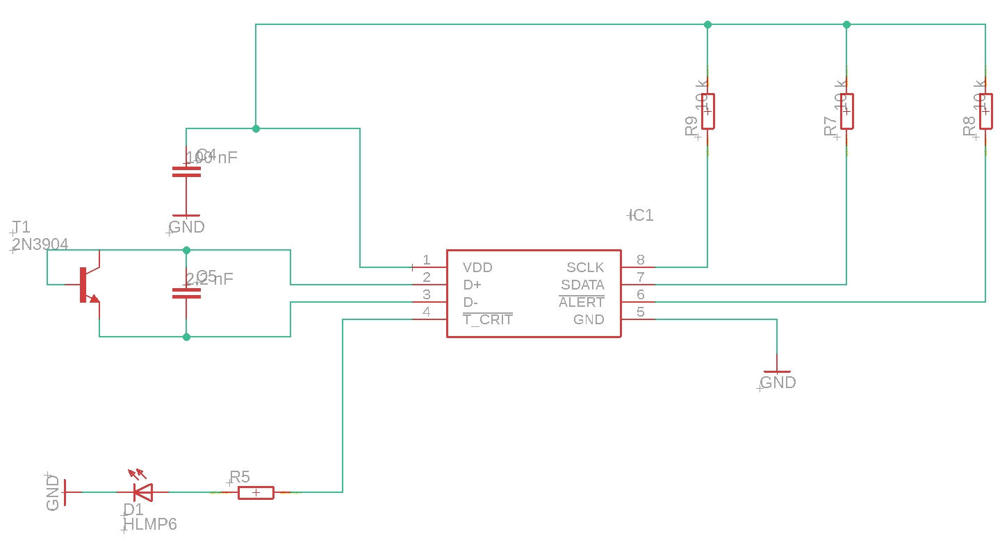      
        
  &emsp; &emsp; `CapteurTemperature.brd`: Le board du PCB du capteur de température     
        
  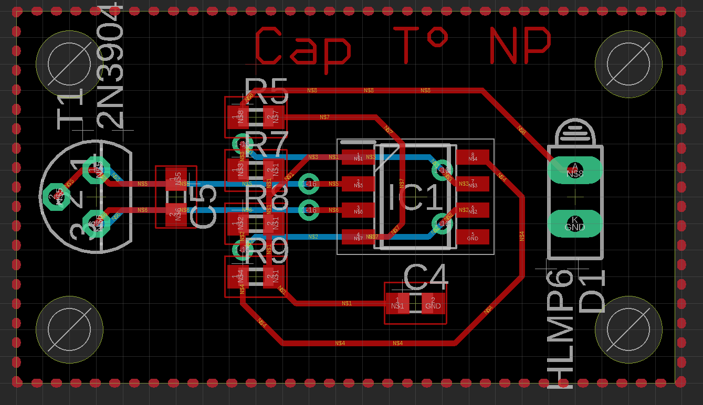      
        
  &emsp; &emsp; `PCBCompost.sch`:  Le schéma du PCB complet du compost  
        
  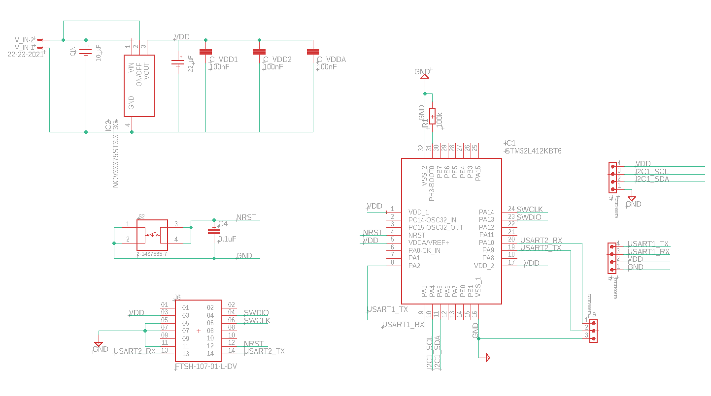      
        
  &emsp; &emsp; `PCBCompost.brd`:  Le board du PCB complet du compost  
        
  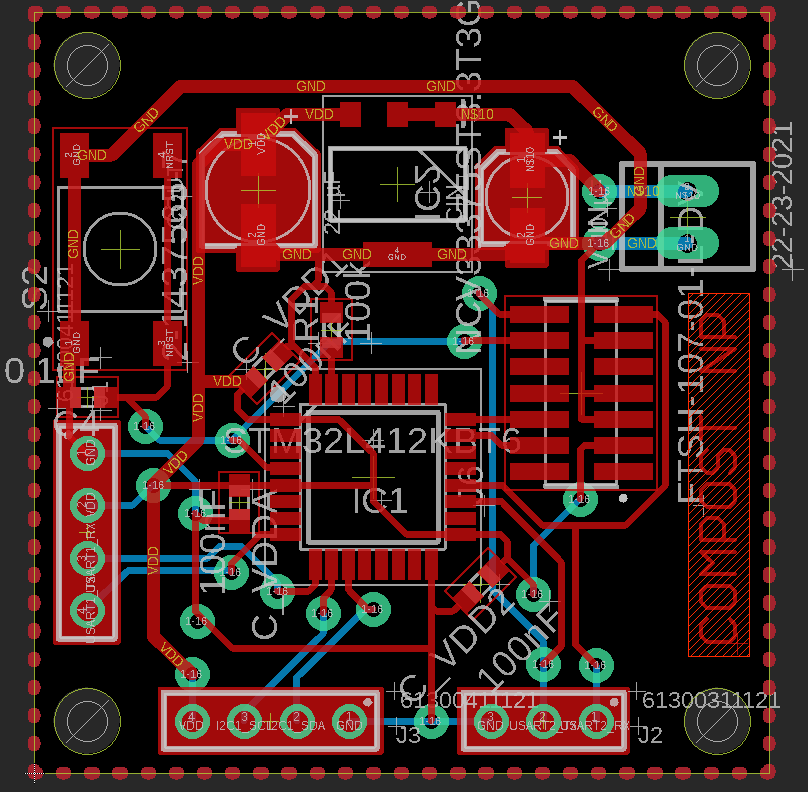    
        
**Code/**               
                
&emsp; &emsp; Ce dossier contient le seul code qu'on a fait, il manque manque le code principal du micropocesseur, le code pHmètre, du campteur de température et d'humidité.           
&emsp; &emsp; `Screen.cpp`: Le code de l'écran en c++

